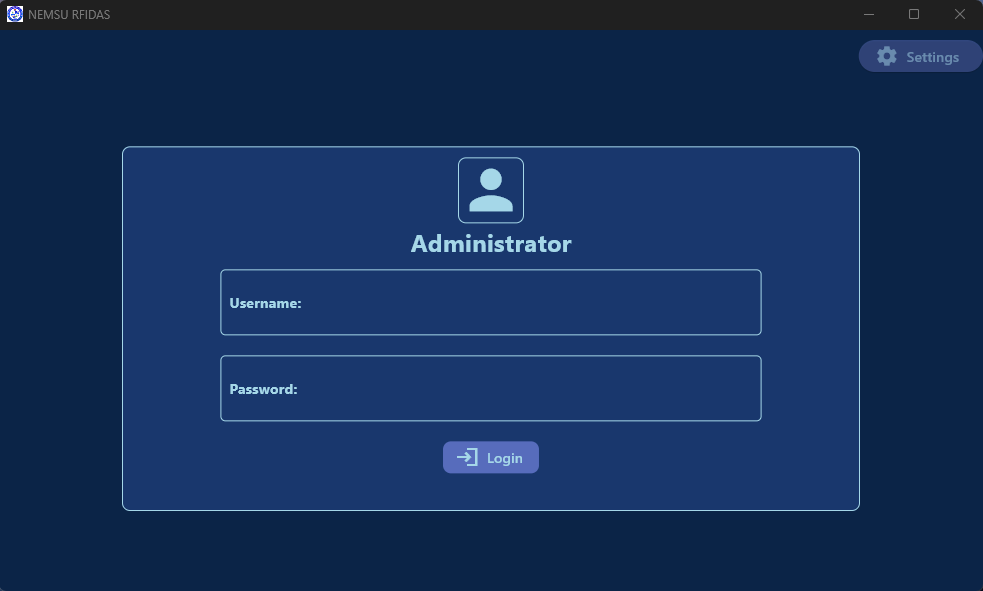

# RFIDAS - RFID Attendance System

This is the client management app that let the user
add/remove/modify user and see attendance data

## Installation
    1. Download the latest release https://github.com/LydianJay/flutter-rfid-attendance-system/releases
    2. Run the program and set the server by pressing the settings button in the login page

## Dependencies
    BACKEND - https://github.com/LydianJay/flutter-rfid-attendance-system-backend
    This uses apache as it's backend server, clone and copy the folder to "www" folder in your apache webserver directory
    

    RFID - https://github.com/LydianJay/esp32-rfid-attendance-system
    The RFID that is used is an MFRC522 driven by an ESP32 *
    To setup the RFID device it needs to be connected to the internet
    and provide the IP address of the server
    